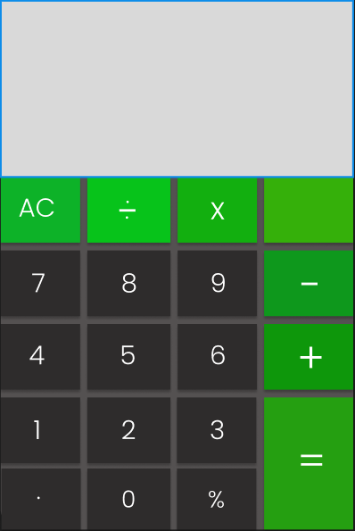

# CalculatorProject-
This is my calculator I'm building along with SEV9.

# MVP
*Minimal Viable Product*

- Calculator Interface
- Functionality
  - Add
  - Subtract
  - Multiply
  - Divide 
  - Clear

# PMVP
*Post Minimal Viable Product*
  - Used Mario theme
  - Used Mario Font for Buttons
  - Replaced backspace button with "Bullet Bill"
  - Animation of mario coin pops up for each click.

  

  
# Wireframes
 

